# Mesa-Chat Messaging App

## Description

This README showcases the screenshots of a sophisticated messaging application built using Laravel 11 and React Inertia.js. Leveraging Reverb as a WebSocket, the system ensures real-time communication with efficient background jobs and events handling.

### Key Features:
- **Admin and Regular Users:** The system distinguishes between administrators and regular users, empowering admins with privileges to manage users.
- **User Management:** Administrators can effortlessly block or unblock users and create new user accounts.
- **Group Communication:** Users have the ability to create groups, fostering collaborative environments within the app.
- **Multimedia Support:** Beyond text messages, users can share attachments such as files and record audio, facilitated by a customized audio player.
- **Interactive Emojis:** Integration with React allows for the seamless incorporation of emojis, enhancing the interactive experience for users.

With its robust features and intuitive interface, this messaging app offers a versatile platform for seamless communication and collaboration.

## Screenshots  

Here are some screenshots showcasing the features of our messaging app:

1. **Login Page**  
   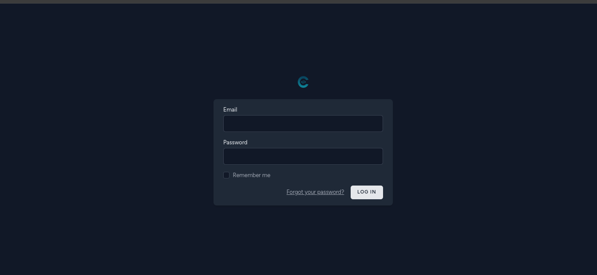

2. **Forgot Password Page**  
   

3. **Forgot Password Response**  
   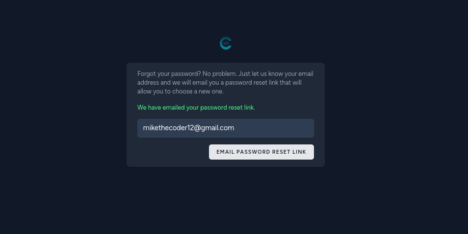

4. **Dashboard Page**  
   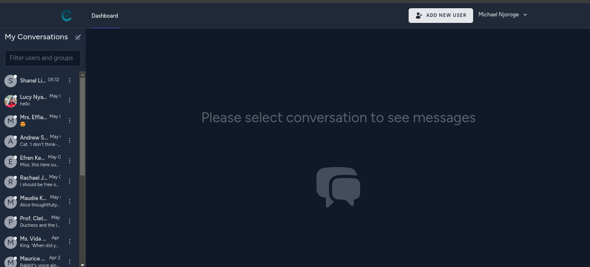

5. **Send Message with Attachments**  
   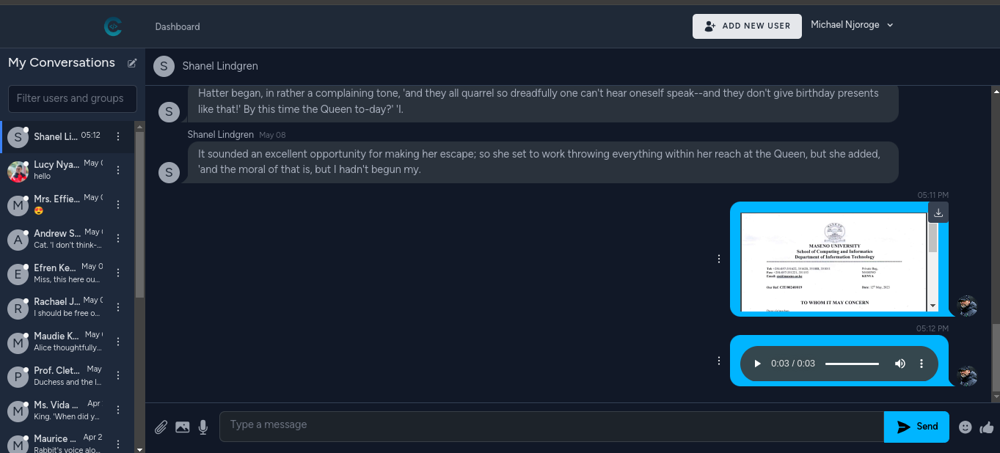

6. **React Emojis Integration**  
   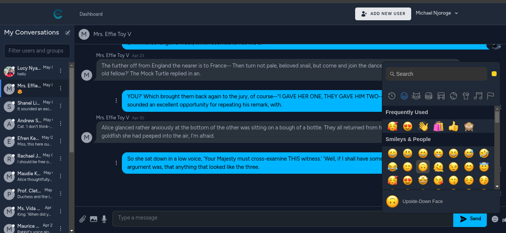

7. **Creation of Users**  
   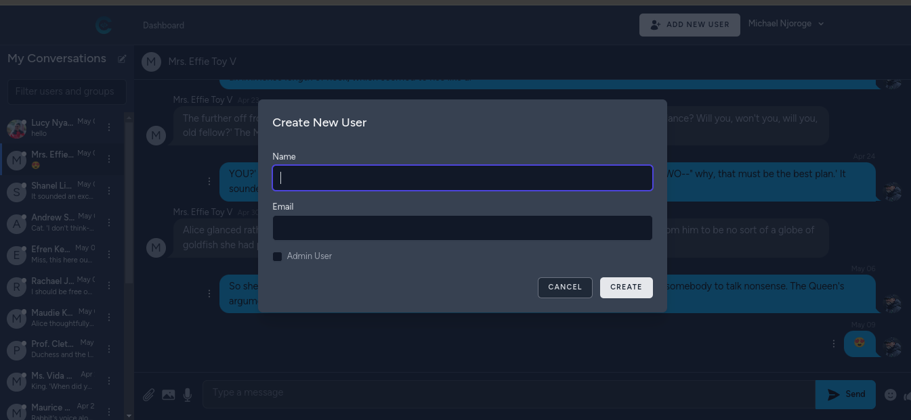

8. **Creation of Users Success**  
   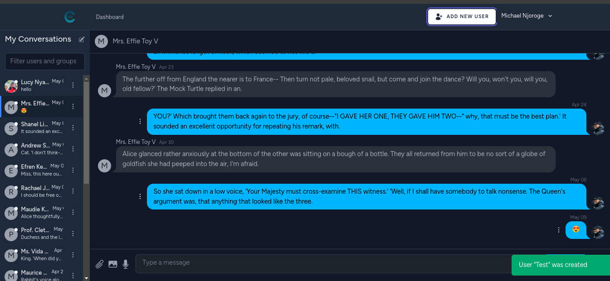

9. **Group Creation**  
   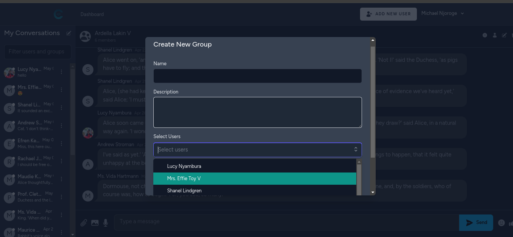

10. **Group Creation Success**  
    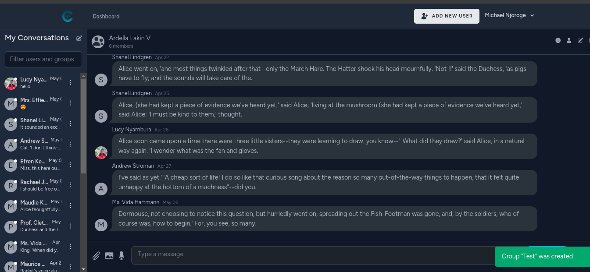

11. **Group Details; Description, Users Edit and Delete**  
    

12. **Group Deletion Scheduling**  
    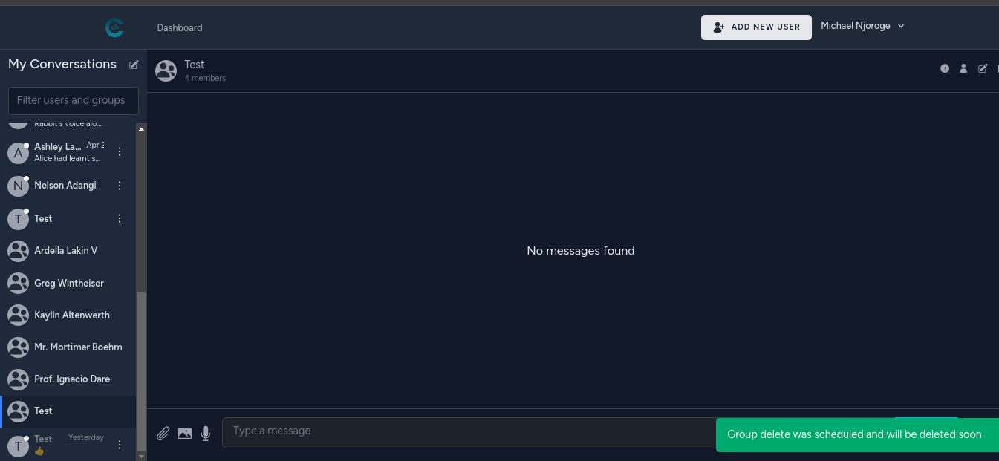

13. **Group Deletion After Some Time**  
    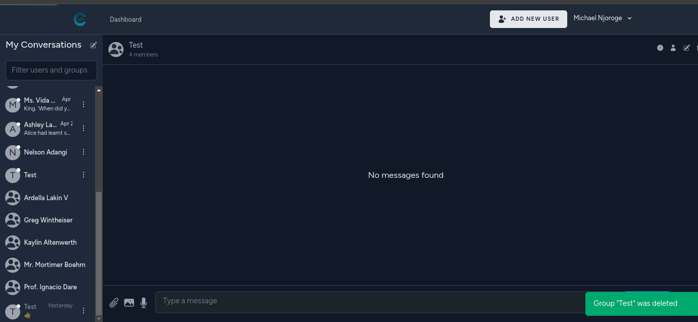

14. **Blocking/Suspending User's Account**  
    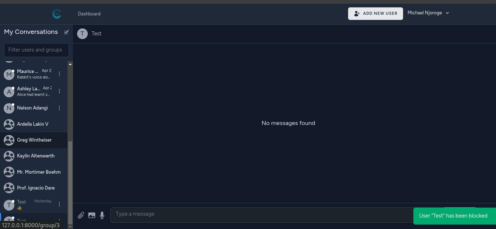

15. **Unblocking/Activating User's Account**  
    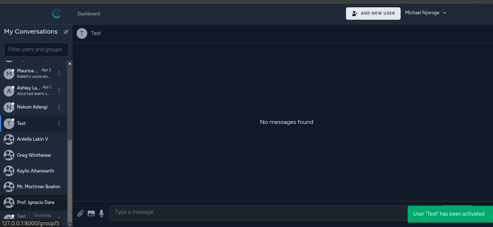

16. **Changing User Role to Admin**  
    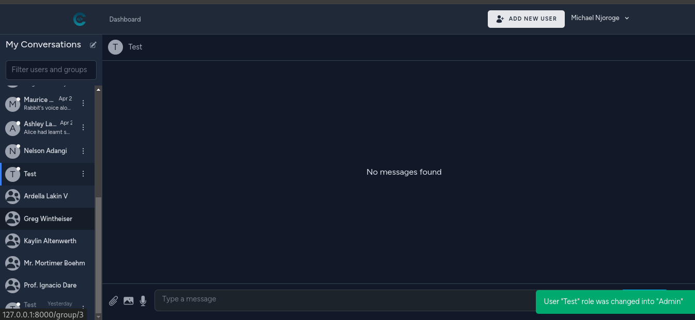

17. **Changing User Role to Regular User**  
    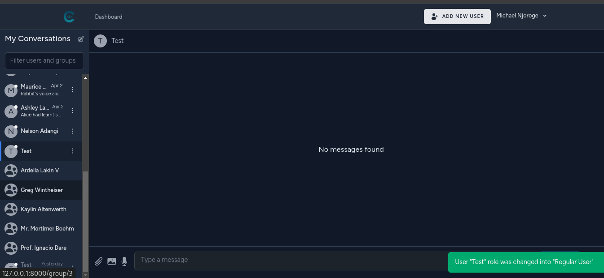

18. **User Profile; Upload Photo, Change Name, Email, or Password**  
    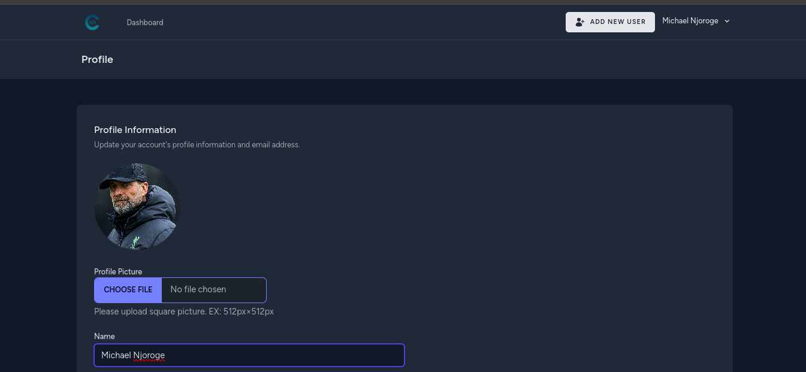
